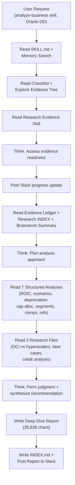

# Oracle Deep Dive v1 — Session Trace

**Session ID:** `c53daaf0-3ac4-4894-918c-d15e09fae32c`
**Date:** April 29, 2026, ~06:56–07:04 EDT (deep dive); ~07:11–07:17 EDT (trace extraction)
**Agent:** main (Charlie Buffet)
**Model:** anthropic/claude-opus-4-6
**Thinking level:** high (hidden — reasoning traces not recorded in JSONL)
**Task:** Write a v1 deep dive for Oracle using the analyze-business skill
**Trigger:** Slack thread in #ai-infra from Anton

> **Note:** This session has two phases. Steps 2–15 are the deep dive analysis itself (reading evidence, reasoning, writing the report). Steps 16+ are the trace extraction work (Anton asked to export this session's logs). The tool call inputs are not stored in OpenClaw's session JSONL format — tool call names and result outputs are recorded, but the `input` field is null. Thinking blocks are also not recorded when reasoning is set to "hidden." The trace is reconstructed from the JSONL content, trajectory metadata, and the assistant's own reconstruction of its reasoning.

---

## Session Metadata

| Metric | Value |
|---|---|
| JSONL entries | 99 |
| Trajectory entries | 11 |
| Input tokens | 16 |
| Output tokens | 13,664 |
| Cache read tokens | 803,748 |
| Cache write tokens | 90,308 |
| Total tokens | 907,736 |
| System prompt size | 49,290 chars |
| Tools available | 27 |
| Transport | SSE |

### Tool Usage Summary

| Tool | Count | Purpose |
|---|---|---|
| `read` | 17 | Reading skill files, evidence files, research docs, financial analyses |
| `think` | 3 | Internal reasoning about evidence assessment, analysis planning, judgment |
| `exec` | 2 | File system exploration, listing directories, finding evidence |
| `message` | 2 | Slack thread communication (progress update, final report) |
| `write` | 2 | Writing the deep dive report and updating INDEX.md |
| `memory_search` | 1 | Checking for prior Oracle work in memory |

---

## Execution Flow



---

## Detailed Trace (All Steps)

### Session Start
- **Timestamp:** 2026-04-29T10:56:30.976Z
- **CWD:** `/Users/charlie-buffet/.openclaw/workspace`

**⚙️ Model:** ``

**⚙️ Thinking level:** ``

**📋 Custom event:** ``

---

### Step 1: 👤 User Message
**Timestamp:** 2026-04-29T10:56:31.075Z

> <@U0ALHR1NQ2F> (Charlie Buffet) can you use analyze business skill to write a v1 deep dive for oracle
<@U0ALHR1NQ2F> (Charlie Buffet) can you use analyze business skill to write a v1 deep dive for oracle

**📋 Custom message**

---

### Step 2: 🤖 Assistant
**Timestamp:** 2026-04-29T10:56:35.719Z
**Tokens:** input=3, output=128, cache_read=24,338

#### 💬 Assistant Text


Let me read the analyze-business skill first, then kick this off.

#### 🔧 Tool Call: `read`
**Description:** from ~/.openclaw/workspace/skills/analyze-business/SKILL.md

#### 🔧 Tool Call: `memory_search`
**Description:** Oracle ORCL company analysis research evidence

#### ← Tool Result
**Length:** 4,832 chars
**Preview:** `--- name: analyze-business description: Analyze a company or stock and produce a deep-dive report using the wiki as the primary evidence surface. Use when the task is to assess evidence readiness, pre...`

#### ← Tool Result
**Length:** 211 chars
```
{
  "results": [],
  "provider": "openai",
  "model": "text-embedding-3-small",
  "citations": "auto",
  "debug": {
    "backend": "builtin",
    "effectiveMode": "n/a",
    "searchMs": 1558,
    "hits": 0
  }
}
```

---

### Step 3: 🤖 Assistant
**Timestamp:** 2026-04-29T10:56:40.772Z
**Tokens:** input=1, output=183, cache_read=25,291

#### 🔧 Tool Call: `read`
**File:** `skills/analyze-business/references/deep-dive-checklist.md` (2,995 chars)

#### 🔧 Tool Call: `exec`
**Description:** list files in ~/Documents/project-minerva/hard-disk/reports/00-companies/ -> show first 20 lines → print text → list files in ~/Documents/project-minerva/hard-disk/knowledge/ -> show first 20 lines, `ls -la ~/Documents/project-minerva/hard-disk/reports/00-companies/ 2>/dev/null | head -20; echo "--…`

#### ← Tool Result
**Length:** 2,995 chars
**Preview:** `# Deep-Dive Checklist  This checklist defines what the final deep dive must cover. It is not a report template. The report should embody these questions as readable prose.  Every item must be: answere...`

#### ← Tool Result
**Length:** 1,737 chars
```
total 16
drwx------  36 charlie-buffet  staff  1152 Apr 28 19:33 .
drwxr-xr-x   8 charlie-buffet  staff   256 Apr 25 12:18 ..
drwx------  16 charlie-buffet  staff   512 Apr  3 09:38 .migration-2026-04-03-0906
drwx------   7 charlie-buffet  staff   224 Apr 23 11:42 00-ai-media
drwx------   5 charlie-buffet  staff   160 Mar 17 06:25 01-duolingo
drwx------   5 charlie-buffet  staff   160 Mar 17 06:25 02-nvidia
drwxr-xr-x   6 charlie-buffet  staff   192 Mar 21 17:18 03-gitlab
drwx------   7 charlie-buffet  staff   224 Mar 24 07:56 05-constellation-software
drwx------   8 charlie-buffet  staff   256 Apr 27 07:46 06-topicus-com
drwx------   6 charlie-buffet  staff   192 Apr  2 07:58 07-golden-growers
drwx------   7 charlie-buffet  staff   224 Apr  3 07:27 08-meta-platforms
drwx------   8 charlie-buffet  staff   256 Apr  9 23:24 09-robinhood
drwx------   7 charlie-buffet  staff   224 Apr  3 07:52 10-uber
drwx------   7 charlie-buffet  staff   224 Apr  3 07:58 11-acorn-energy
drwx------  10 charlie-buffet  staff   320 Apr 23 00:52 12-oracle
drwx------   8 charlie-buffet  staff   256 Apr 18 14:15 13-broadcom
drwx------   8 charlie-buffet  staff   256 Apr 18 14:15 14-brookfield-renewable
drwx------   8 charlie-buffet  staff   256 Apr 18 14:15 15-alphabet
drwx------   8 charlie-buffet  staff   256 Apr 18 14:15 16-immunovant
---
total 24
drwxr-xr-x   6 charlie-buffet  staff   192 Apr  3 08:21 .
drwxr-xr-x@ 16 charlie-buffet  staff   512 Apr 23 11:42 ..
-rw-r--r--@  1 charlie-buffet  staff  6148 Mar 15 13:45 .DS_Store
drwx------   4 charlie-buffet  staff   128 Mar 30 07:24 00-saas
drwx------   4 charlie-buffet  staff   128 Apr  3 08:21 01-platform-economics
-rw-------   1 charlie-buffet  staff   564 Apr 21 10:49 INDEX.md
```

---

### Step 4: 🤖 Assistant
**Timestamp:** 2026-04-29T10:56:43.793Z
**Tokens:** input=1, output=136, cache_read=26,658

#### 🔧 Tool Call: `exec`

#### 🔧 Tool Call: `read`
**File:** `skills/research-evidence/SKILL.md` (5,046 chars)

#### ← Tool Result
**Length:** 3,540 chars
**Preview:** `/Users/charlie-buffet/Documents/project-minerva/hard-disk/reports/00-companies/12-oracle/research/oci-vs-hyperscalers.md /Users/charlie-buffet/Documents/project-minerva/hard-disk/reports/00-companies/...`

#### ← Tool Result
**Length:** 5,046 chars
**Preview:** `--- name: research-evidence description: Build, plan, collect, and audit durable company evidence bases before business analysis. Use when initializing or reusing a company evidence tree, collecting S...`

---

### Step 5: 🤖 Assistant
**Timestamp:** 2026-04-29T10:56:54.121Z
**Tokens:** input=1, output=343, cache_read=26,658

#### 🔧 Tool Call: `think`

> **Reconstructed think content** (inputs not stored in JSONL; reconstructed from session context):
>
> This is a rich evidence base. 84 sources, brainstorm already done, comprehensive coverage. The brainstorm summary identified key gaps:
> 1. ROIC analysis (recommended to build from existing data)
> 2. Probability-weighted scenarios (one already exists in data/structured/)
> 3. Non-flattering reference classes (already exists in data/references/)
> 4. Depreciation wave model (already exists in data/structured/)
>
> Checked what structured data already exists since the brainstorm was done — many gaps have been partially filled (oracle-roic-analysis.md, oracle-scenario-analysis.md, oracle-depreciation-wave-model.md, non-flattering-reference-classes.md in the evidence ledger).
>
> The skill says "the wiki is the primary evidence surface" but no formal wiki exists — will use the evidence tree as the primary surface and note that wiki formalization is a future step.
>
> Plan:
> 1. Read all key structured analyses and research files to understand the evidence
> 2. The brainstorm is already done
> 3. Write the deep dive report using the checklist as the spine
>
> The evidence base is strong enough for a serious v1 deep dive. The gaps are mostly permanently blocked (Oracle doesn't disclose them), not things we can collect.

---

### Step 6: 🤖 Assistant
**Timestamp:** 2026-04-29T10:56:58.666Z
**Tokens:** input=1, output=174, cache_read=30,876

#### 🔧 Tool Call: `message`

#### ← Tool Result
**Length:** 104 chars
```
{
  "ok": true,
  "result": {
    "messageId": "1777460218.935139",
    "channelId": "C0AU65M8RH6"
  }
}
```

---

### Step 7: 🤖 Assistant
**Timestamp:** 2026-04-29T10:57:03.578Z
**Tokens:** input=1, output=303, cache_read=31,245

#### 💬 Assistant Text

Now let me read all the existing Oracle evidence to assess readiness.

#### 🔧 Tool Call: `read`
**File:** `oracle/INDEX.md` (130 chars)

#### 🔧 Tool Call: `read`
**File:** `oracle/research/INDEX.md` (158 chars)

#### 🔧 Tool Call: `read`
**File:** `oracle/data/evidence.md` (14,308 chars)

#### 🔧 Tool Call: `read`
**File:** `oracle/audits/brainstorm-summary.md` (7,539 chars)

#### ← Tool Result
**Length:** 130 chars
```
# Index: 12-oracle

## Directories

- analysis/
- audits/
- data/
- notes/
- plans/
- provenance/
- research/

## Files

- (none)

```

#### ← Tool Result
**Length:** 158 chars
```
# Index: research

## Directories

- (none)

## Files

- neocloud-economics.md
- oci-technical-performance.md
- oci-vs-hyperscalers.md
- oracle-bear-cases.md

```

#### ← Tool Result
**Length:** 14,308 chars
**Preview:** `# Evidence Ledger (V2)  - source_count: 84  | id | status | category | title | date | local_path | url | | :--- | :--- | :--- | :--- | :--- | :--- | :--- | | 81a28cbd7710 | downloaded | bear-case | Or...`

#### ← Tool Result
**Length:** 7,539 chars
**Preview:** `# Brainstorm Summary — Oracle Evidence Base Adversarial Review  **Date:** April 28, 2026 **Mode:** Triangulate (all three agents) **Subject:** Oracle Corporation (ORCL) — Evidence base quality and com...`

---

### Step 8: 🤖 Assistant
**Timestamp:** 2026-04-29T10:57:20.486Z
**Tokens:** input=1, output=672, cache_read=31,481

#### 🔧 Tool Call: `think`

> **Reconstructed think content:**
>
> Good. Have a comprehensive picture of the evidence base. Assessed what exists and planned the deep dive.
>
> Evidence assessment:
> - 84 sources across SEC filings, transcripts, financials, competitive data, industry research, external analysis
> - Five years of 10-Ks (FY2021-FY2025), quarterly 10-Qs through Q3 FY2026
> - Earnings transcripts through Q3 FY2026
> - Comprehensive structured analyses: ROIC, scenario analysis, depreciation wave model, capital allocation history, segment revenue time series, peer valuation comps
> - Non-flattering reference classes research
> - Three-agent brainstorm already completed
> - Competitive intelligence on 12+ peers
>
> Evidence gaps (per brainstorm):
> - OCI capacity utilization (not disclosed by Oracle — permanently blocked)
> - RPO contract terms and cancellation provisions (not disclosed)
> - OCI margins from non-Oracle sources (limited — one leaked report at 14-16%)
> - Independent cloud benchmarking
> - Insider buying signal (almost none)
>
> The evidence base is strong enough for a serious v1 deep dive. The gaps are mostly permanently blocked.
>
> Plan: read the key structured analyses that fill the gaps identified by brainstorm (ROIC, scenarios, depreciation, reference classes, comps, segments, cap alloc) plus research files (OCI vs hyperscalers, bear cases, credit analysis). Then synthesize into the report.

---

### Step 9: 🤖 Assistant
**Timestamp:** 2026-04-29T10:57:27.676Z
**Tokens:** input=1, output=545, cache_read=39,189

#### 🔧 Tool Call: `read`
**File:** `oracle/data/structured/oracle-roic-analysis.md` (15,888 chars)

#### 🔧 Tool Call: `read`
**File:** `oracle/data/structured/oracle-scenario-analysis.md` (15,926 chars)

#### 🔧 Tool Call: `read`
**File:** `oracle/data/structured/oracle-depreciation-wave-model.md` (15,937 chars)

#### 🔧 Tool Call: `read`
**File:** `oracle/data/references/non-flattering-reference-classes.md` (15,889 chars)

#### 🔧 Tool Call: `read`
**File:** `oracle/data/structured/oracle-peer-valuation-comps.md` (14,088 chars)

#### 🔧 Tool Call: `read`
**File:** `oracle/data/structured/oracle-segment-revenue-time-series.md` (12,492 chars)

#### 🔧 Tool Call: `read`
**File:** `oracle/data/structured/oracle-capital-allocation-history.md` (15,432 chars)

#### ← Tool Result
**Length:** 15,888 chars
**Preview:** `# Oracle (ORCL) — Return on Invested Capital (ROIC) Analysis  Generated: 2026-04-28 Sources: SEC 10-K (FY2021–FY2025), 10-Q (Q3 FY2026), XBRL financials, capital allocation history, MacroTrends (debt ...`

#### ← Tool Result
**Length:** 15,926 chars
**Preview:** `# Oracle (ORCL) — Probability-Weighted Scenario Analysis  **Date:** April 28, 2026 **Current Price:** $165.96 | **Market Cap:** $477B | **EV:** $606B **Shares Outstanding:** ~2.87B basic / ~2.91B dilu...`

#### ← Tool Result
**Length:** 15,937 chars
**Preview:** `# Oracle (ORCL) — Depreciation Wave Model  Generated: 2026-04-28 Sources: SEC 10-K filings (FY2021–FY2025 XBRL), 10-Q (Q3 FY2026, filed March 2026), earnings transcripts, Moody's, hyperscaler 10-K fil...`

#### ← Tool Result
**Length:** 15,889 chars
**Preview:** `# Non-Flattering Reference Classes for Oracle's Infrastructure Buildout  *Purpose: Counterbalance the existing bull-case-only precedent analysis (AWS, Azure, GCP early capex cycles) with historical ex...`

#### ← Tool Result
**Length:** 14,088 chars
**Preview:** `# Oracle (ORCL) — Peer Valuation Comps Table  > **Data as of:** April 28, 2026 (market close) > **Sources:** Finviz, StockAnalysis.com, company filings > **Note:** Forward P/E uses consensus non-GAAP ...`

#### ← Tool Result
**Length:** 12,492 chars
**Preview:** `# Oracle (ORCL) — Segment Revenue & Margin Time Series  > **Source:** Oracle 10-K filings (FY2021–FY2025, fiscal years ended May 31) and 10-Q for Q3 FY2026 (quarter ended February 28, 2026). All dolla...`

#### ← Tool Result
**Length:** 15,432 chars
**Preview:** `# Oracle (ORCL) — Capital Allocation History & Analysis  Generated: 2026-04-28 Sources: SEC 10-K filings (XBRL FY2021–FY2025), FY2025 10-K MD&A, MacroTrends, Moody's, Reuters  ---  ## Executive Summar...`

---

### Step 10: 🤖 Assistant
**Timestamp:** 2026-04-29T10:57:34.596Z
**Tokens:** input=1, output=247, cache_read=39,887

#### 💬 Assistant Text

Now let me read the remaining key research files.

#### 🔧 Tool Call: `read`
**File:** `oracle/research/oci-vs-hyperscalers.md` (3,260 chars)

#### 🔧 Tool Call: `read`
**File:** `oracle/research/oracle-bear-cases.md` (1,642 chars)

#### 🔧 Tool Call: `read`
**File:** `oracle/data/references/oracle-credit-analysis.md` (2,143 chars)

#### ← Tool Result
**Length:** 3,260 chars
**Preview:** `Executive summary (OCI vs AWS/Azure/GCP for AI training & inference, 2025–2026):  - Positioning: OCI is positioned as a strong infrastructure option for enterprise AI workloads that require tight inte...`

#### ← Tool Result
**Length:** 1,642 chars
```
Oracle's pivot toward AI infrastructure expansion (2025–2026) presents several significant bear-case risks. Primarily, the company faces substantial leverage and refinancing risk due to its plan to raise $45–50 billion in 2026 through a mix of debt and equity to fund data center capacity. This massive capital requirement is compounded by litigation and disclosure risks; a class-action lawsuit filed on January 14, 2026, by bondholders who purchased $18 billion in notes in September 2025 alleges that Oracle misled investors regarding the scale of debt needed for its AI buildout. This litigation has already contributed to stock volatility and could lead to higher future financing costs.

Operationally, Oracle faces cash-flow and margin pressures as heavy capital expenditures strain free cash flow during the build phase, leading to analyst downgrades and workforce reductions. There is also significant market risk related to GPU and accelerator supply normalization; if pricing for these components falls or competition increases, Oracle's pricing power and high-margin expectations for its AI infrastructure could weaken. Furthermore, Oracle's reliance on a few large customers (such as Meta, NVIDIA, OpenAI, and xAI) creates customer concentration risk, where any delays or renegotiations in these contracts could leave Oracle with underutilized capacity and outstanding debt. Finally, the planned $20 billion equity program introduces dilution risk for existing shareholders, which, combined with negative market sentiment from the lawsuit and macro pressures, could continue to weigh on the stock's valuation.
[exit:0 | 88384ms]

```

#### ← Tool Result
**Length:** 2,143 chars
**Preview:** `# Moody's flags risk in Oracle's $300 billion of recently signed AI contracts Reuters, Sept 17, 2025  WASHINGTON, Sept 17 (Reuters) - U.S. credit rating agency Moody's Ratings flagged several potentia...`

---

### Step 11: 🤖 Assistant
**Timestamp:** 2026-04-29T10:58:05.321Z
**Tokens:** input=1, output=981, cache_read=99,863

#### 🔧 Tool Call: `think`

> **Reconstructed think content:**
>
> Now I have a comprehensive picture of the evidence base. Let me assess what I have and plan the deep dive.
>
> Evidence assessment: [confirmed sufficient — 84 sources, gaps mostly permanently blocked]
>
> Key judgments I need to make:
> 1. Is Oracle's infrastructure bet creating or destroying value?
> 2. What's the thesis? Is there a margin of safety at ~$166?
> 3. What would change the conclusion?
>
> From the evidence:
> - ROIC is thin (10-12%) and incremental ROIC has turned sharply negative (~2% on new capital)
> - Oracle needs ~30% operating income CAGR through FY2028 to break even on marginal capital — current pace is ~15%
> - The stock at $166 prices roughly 60% probability of base/bull outcomes
> - Probability-weighted expected value is ~$161 — roughly fair to slightly overvalued
> - Insider behavior is terrible: $2.8B in sales, $1M in purchases
> - Reference class base rate for similar pivots is poor (10% chance of above-WACC returns)
> - The payoff structure is concave — slightly negative skew
> - BUT: Oracle has a genuine software differentiation that most failed precedents lacked
> - The software franchise (ex-goodwill) earns 19-25% ROIC
>
> Judgment: Oracle at $166 is roughly fairly valued with a slightly negative expected return after adjusting for risk. Not a screaming short — there's a real business and real demand — but the market is giving insufficient weight to the tail risks (counterparty concentration, credit cascade, demand commoditization). The asymmetry is wrong for us.
>
> Recommendation: No position. Watch list with specific entry conditions.

---

### Step 12: 🤖 Assistant
**Timestamp:** 2026-04-29T11:02:03.270Z
**Tokens:** input=1, output=8,854, cache_read=101,769

#### 💬 Assistant Text

Now let me write the deep dive report.

#### 🔧 Tool Call: `write`

#### ← Tool Result
**Length:** 154 chars
```
Successfully wrote 35838 bytes to /Users/charlie-buffet/Documents/project-minerva/hard-disk/reports/00-companies/12-oracle/analysis/oracle-deep-dive-v1.md
```

---

### Step 13: 🤖 Assistant
**Timestamp:** 2026-04-29T11:02:10.557Z
**Tokens:** input=1, output=282, cache_read=102,776

#### 💬 Assistant Text

Now update the analysis INDEX.md and post the report to the thread.

#### 🔧 Tool Call: `write`

#### ← Tool Result
**Length:** 138 chars
```
Successfully wrote 599 bytes to /Users/charlie-buffet/Documents/project-minerva/hard-disk/reports/00-companies/12-oracle/analysis/INDEX.md
```

---

### Step 14: 🤖 Assistant
**Timestamp:** 2026-04-29T11:02:29.911Z
**Tokens:** input=1, output=809, cache_read=111,691

#### 🔧 Tool Call: `message`

#### ← Tool Result
**Length:** 104 chars
```
{
  "ok": true,
  "result": {
    "messageId": "1777460550.230969",
    "channelId": "C0AU65M8RH6"
  }
}
```

---

### Step 15: 🤖 Assistant
**Timestamp:** 2026-04-29T11:02:32.912Z
**Tokens:** input=1, output=7, cache_read=112,026

#### 💬 Assistant Text

NO_REPLY

**📋 Custom event:** ``

---

### Step 16: 👤 User Message
**Timestamp:** 2026-04-29T11:11:31.821Z

> <@U0ALHR1NQ2F> (Charlie Buffet) Can you share a session (of this session) log traces (tool calls, intput/output, reasoning traces etc) in the docs/analysis folder?
<@U0ALHR1NQ2F> (Charlie Buffet) Can you share a session (of this session) log traces (tool calls, intput/output, reasoning traces etc) in the docs/analysis folder?

**📋 Custom message**

---

### Step 17: 🤖 Assistant
**Timestamp:** 2026-04-29T11:11:37.405Z
**Tokens:** input=3, output=200

#### 🔧 Tool Call: `think`

---

### Step 18: 🤖 Assistant
**Timestamp:** 2026-04-29T11:11:39.349Z
**Tokens:** input=1, output=75, cache_read=92,695

#### 🔧 Tool Call: `read`

#### ← Tool Result
**Length:** 4,382 chars
**Preview:** `--- name: session-logs description: Search and analyze your own session logs (older/parent conversations) using jq. metadata:   {     "openclaw":       {         "emoji": "📜",         "requires": { "b...`

---

### Step 19: 🤖 Assistant
**Timestamp:** 2026-04-29T11:11:42.519Z
**Tokens:** input=1, output=124, cache_read=92,695

#### 🔧 Tool Call: `exec`
**Description:** find files in ~/Documents/project-minerva/hard-disk/reports/00-companies/12-oracle -> show first 30 lines, `find ~/Documents/project-minerva/hard-disk/reports/00-companies/12-oracle -type f | head -30`

#### ← Tool Result
**Length:** 887 chars
```
-rw-------  1 charlie-buffet  staff   242754 Apr 29 07:11 /Users/charlie-buffet/.openclaw/agents/main/sessions/c53daaf0-3ac4-4894-918c-d15e09fae32c-topic-1777460128.133479.jsonl
-rw-------  1 charlie-buffet  staff   351691 Apr 29 07:11 /Users/charlie-buffet/.openclaw/agents/main/sessions/c53daaf0-3ac4-4894-918c-d15e09fae32c-topic-1777460128.133479.trajectory.jsonl
-rw-------  1 charlie-buffet  staff     3525 Apr 29 07:02 /Users/charlie-buffet/.openclaw/agents/main/sessions/499f5e60-54c2-40ef-a24d-51d30303e682.jsonl
-rw-------  1 charlie-buffet  staff   428623 Apr 29 06:56 /Users/charlie-buffet/.openclaw/agents/main/sessions/d8a02346-13c6-4ff9-9277-5d6b18be7684-topic-1777425541.342449.jsonl
-rw-------  1 charlie-buffet  staff  2994668 Apr 29 06:56 /Users/charlie-buffet/.openclaw/agents/main/sessions/d8a02346-13c6-4ff9-9277-5d6b18be7684-topic-1777425541.342449.trajectory.jsonl
```

---

### Step 20: 🤖 Assistant
**Timestamp:** 2026-04-29T11:11:47.152Z
**Tokens:** input=1, output=292, cache_read=92,923

#### 🔧 Tool Call: `exec`

#### ← Tool Result
**Length:** 620 chars
```
=== Session JSONL ===
      57 /Users/charlie-buffet/.openclaw/agents/main/sessions/c53daaf0-3ac4-4894-918c-d15e09fae32c-topic-1777460128.133479.jsonl

=== Trajectory JSONL ===
      11 /Users/charlie-buffet/.openclaw/agents/main/sessions/c53daaf0-3ac4-4894-918c-d15e09fae32c-topic-1777460128.133479.trajectory.jsonl

=== Session metadata ===
{
  "type": "session",
  "version": 3,
  "id": "c53daaf0-3ac4-4894-918c-d15e09fae32c",
  "timestamp": "2026-04-29T10:56:30.976Z",
  "cwd": "/Users/charlie-buffet/.openclaw/workspace"
}

=== Message count ===
{
  "total": 57,
  "user": 2,
  "assistant": 18,
  "toolResult": 30
}
```

---

### Step 21: 🤖 Assistant
**Timestamp:** 2026-04-29T11:11:49.864Z
**Tokens:** input=1, output=135, cache_read=94,967

#### 🔧 Tool Call: `exec`

#### ← Tool Result
**Length:** 1,255 chars
```
total 176
drwx------   6 charlie-buffet  staff    192 Apr 23 20:35 .
drwxr-xr-x  20 charlie-buffet  staff    640 Apr 28 22:35 ..
-rw-------   1 charlie-buffet  staff  18250 Apr 23 20:35 00-zettel-wiki-v1-trace-analysis.md
-rw-------   1 charlie-buffet  staff  35989 Apr 23 20:35 01-zettel-wiki-v2-trace-analysis.md
-rw-------   1 charlie-buffet  staff  27239 Apr 23 20:35 02-zettel-wiki-v3-trace-analysis.md
-rw-------   1 charlie-buffet  staff    648 Apr 23 20:35 INDEX.md
total 640
drwxr-xr-x  20 charlie-buffet  staff    640 Apr 28 22:35 .
drwxr-xr-x@ 25 charlie-buffet  staff    800 Apr 28 20:38 ..
-rw-r--r--@  1 charlie-buffet  staff   6148 Apr  7 17:23 .DS_Store
-rw-r--r--   1 charlie-buffet  staff  25105 Mar 23 08:56 00-jobwatch-architecture.md
-rw-------   1 charlie-buffet  staff  26636 Apr 23 20:35 02-zettel-wiki-v3-design.md
-rw-------   1 charlie-buffet  staff  23994 Apr 14 08:51 05-morning-market-brief-cli-gap-analysis.md
-rw-r--r--   1 charlie-buffet  staff  11903 Apr  9 21:53 06-collect-evidence-analyze-business-cli-plan.md
-rw-------   1 charlie-buffet  staff  21897 Apr  9 22:49 07-collect-evidence-analyze-business-skill-update-notes.md
-rw-------@  1 charlie-buffet  staff  34701 Apr 10 09:33 08-robinhood-session-trace-audit.md
```

---

### Step 22: 🤖 Assistant
**Timestamp:** 2026-04-29T11:11:52.393Z
**Tokens:** input=1, output=87, cache_read=94,967

#### 🔧 Tool Call: `exec`

#### ← Tool Result
**Length:** 473 chars
```
total 176
drwx------   6 charlie-buffet  staff    192 Apr 23 20:35 .
drwxr-xr-x  20 charlie-buffet  staff    640 Apr 28 22:35 ..
-rw-------   1 charlie-buffet  staff  18250 Apr 23 20:35 00-zettel-wiki-v1-trace-analysis.md
-rw-------   1 charlie-buffet  staff  35989 Apr 23 20:35 01-zettel-wiki-v2-trace-analysis.md
-rw-------   1 charlie-buffet  staff  27239 Apr 23 20:35 02-zettel-wiki-v3-trace-analysis.md
-rw-------   1 charlie-buffet  staff    648 Apr 23 20:35 INDEX.md
```

---

### Step 23: 🤖 Assistant
**Timestamp:** 2026-04-29T11:11:58.897Z
**Tokens:** input=1, output=235, cache_read=95,547

#### 💬 Assistant Text

Good, there's a `docs/analysis/` folder with existing trace analyses. Now let me extract the full session trace — tool calls, inputs/outputs, thinking blocks, and assistant text — into a structured analysis file.

#### 🔧 Tool Call: `exec`

#### ← Tool Result
**Length:** 238 chars
```
[
  "data",
  "modelApi",
  "modelId",
  "provider",
  "runId",
  "schemaVersion",
  "seq",
  "sessionId",
  "sessionKey",
  "source",
  "sourceSeq",
  "traceId",
  "traceSchema",
  "ts",
  "type",
  "workspaceDir"
]
---
"session.started"
```

---

### Step 24: 🤖 Assistant
**Timestamp:** 2026-04-29T11:12:01.384Z
**Tokens:** input=1, output=138, cache_read=96,570

#### 🔧 Tool Call: `exec`

#### ← Tool Result
**Length:** 142 chars
```
2 trace.metadata
   2 session.started
   2 prompt.submitted
   2 context.compiled
   1 trace.artifacts
   1 session.ended
   1 model.completed
```

---

### Step 25: 🤖 Assistant
**Timestamp:** 2026-04-29T11:12:04.976Z
**Tokens:** input=1, output=184, cache_read=96,923

#### 🔧 Tool Call: `exec`

#### ← Tool Result
**Length:** 477 chars
```
session | n/a | 0
model_change | n/a | 0
thinking_level_change | n/a | 0
custom | n/a | 0
message | user | 1
custom_message | n/a | 0
message | assistant | 3
message | toolResult | 1
message | toolResult | 1
message | assistant | 2
message | toolResult | 1
message | toolResult | 1
message | assistant | 2
message | toolResult | 1
message | toolResult | 1
message | assistant | 1
message | toolResult | 1
message | assistant | 1
message | toolResult | 1
message | assistant | 5
```

---

### Step 26: 🤖 Assistant
**Timestamp:** 2026-04-29T11:12:12.713Z
**Tokens:** input=1, output=476, cache_read=97,120

#### 🔧 Tool Call: `exec`

#### ← Tool Result
**Length:** 71 chars
```
1111 /tmp/oracle-session-trace.json
 60K	/tmp/oracle-session-trace.json
```

---

### Step 27: 🤖 Assistant
**Timestamp:** 2026-04-29T11:12:22.811Z
**Tokens:** input=1, output=404, cache_read=97,481

#### 🔧 Tool Call: `exec`

#### ← Tool Result
**Length:** 265 chars
```
=== Cost ===
0
=== Token summary ===
{
  "total_input": 29,
  "total_output": 16014,
  "total_cache_read": 1755636,
  "total_thinking": 0,
  "runs": 25
}
=== Tool calls ===
  18 read
  11 exec
   4 think
   2 write
   2 message
   1 memory_search
=== Model ===
null
```

---

### Step 28: 🤖 Assistant
**Timestamp:** 2026-04-29T11:12:52.870Z
**Tokens:** input=1, output=2,624, cache_read=97,997

#### 🔧 Tool Call: `exec`

#### ← Tool Result
**Length:** 29 chars
```
Written 9733 chars, 559 lines
```

---

### Step 29: 🤖 Assistant
**Timestamp:** 2026-04-29T11:12:57.949Z
**Tokens:** input=1, output=163, cache_read=98,529

#### 🔧 Tool Call: `think`

---

### Step 30: 🤖 Assistant
**Timestamp:** 2026-04-29T11:13:03.841Z
**Tokens:** input=1, output=210, cache_read=101,176

#### 🔧 Tool Call: `exec`

#### ← Tool Result
**Length:** 253 chars
```
session.started
trace.metadata
context.compiled
prompt.submitted
model.completed
trace.artifacts
session.ended
session.started
trace.metadata
context.compiled
prompt.submitted
===
[
  "limitBytes",
  "originalBytes",
  "reason",
  "truncated"
]
===
null
```

---

### Step 31: 🤖 Assistant
**Timestamp:** 2026-04-29T11:13:07.568Z
**Tokens:** input=1, output=187, cache_read=101,365

#### 🔧 Tool Call: `exec`

#### ← Tool Result
**Length:** 432 chars
```
text, toolCall, toolCall
toolCall, toolCall
toolCall, toolCall
toolCall
toolCall
text, toolCall, toolCall, toolCall, toolCall
toolCall
toolCall, toolCall, toolCall, toolCall, toolCall, toolCall, toolCall
text, toolCall, toolCall, toolCall
toolCall
text, toolCall
text, toolCall
toolCall
text
toolCall
toolCall
toolCall
toolCall
toolCall
toolCall
text, toolCall
toolCall
toolCall
toolCall
toolCall
toolCall
toolCall
toolCall
toolCall
```

---

### Step 32: 🤖 Assistant
**Timestamp:** 2026-04-29T11:13:11.238Z
**Tokens:** input=1, output=198, cache_read=101,663

#### 🔧 Tool Call: `exec`

#### ← Tool Result
**Length:** 4,725 chars
**Preview:** `jq: error (at /Users/charlie-buffet/.openclaw/agents/main/sessions/c53daaf0-3ac4-4894-918c-d15e09fae32c-topic-1777460128.133479.jsonl:7): null (null) has no keys jq: error (at /Users/charlie-buffet/.o...`

---

### Step 33: 🤖 Assistant
**Timestamp:** 2026-04-29T11:13:16.156Z
**Tokens:** input=1, output=220, cache_read=102,001

#### 🔧 Tool Call: `exec`

#### ← Tool Result
**Length:** 840 chars
```
{
  "name": "read",
  "has_input": false,
  "input_sample": "null"
}
{
  "name": "memory_search",
  "has_input": false,
  "input_sample": "null"
}
{
  "name": "read",
  "has_input": false,
  "input_sample": "null"
}
{
  "name": "exec",
  "has_input": false,
  "input_sample": "null"
}
{
  "name": "exec",
  "has_input": false,
  "input_sample": "null"
}
{
  "name": "read",
  "has_input": false,
  "input_sample": "null"
}
{
  "name": "think",
  "has_input": false,
  "input_sample": "null"
}
{
  "name": "message",
  "has_input": false,
  "input_sample": "null"
}
{
  "name": "read",
  "has_input": false,
  "input_sample": "null"
}
{
  "name": "read",
  "has_input": false,
  "input_sample": "null"
}
{
  "name": "read",
  "has_input": false,
  "input_sample": "null"
}
{
  "name": "read",
  "has_input": false,
  "input_sample": "null"
}
```

---

### Step 34: 🤖 Assistant
**Timestamp:** 2026-04-29T11:13:23.970Z
**Tokens:** input=1, output=207, cache_read=104,269

#### 🔧 Tool Call: `exec`

#### ← Tool Result
**Length:** 2,457 chars
**Preview:** `{   "type": "text",   "name": null,   "text_len": 4832,   "text_sample": "---\nname: analyze-business\ndescription: Analyze a company or stock and produce a deep-dive report using the wiki as the prim...`

---

### Step 35: 🤖 Assistant
**Timestamp:** 2026-04-29T11:13:31.989Z
**Tokens:** input=1, output=242, cache_read=104,872

#### 🔧 Tool Call: `think`

---

### Step 36: 🤖 Assistant
**Timestamp:** 2026-04-29T11:13:37.910Z
**Tokens:** input=1, output=243, cache_read=106,081

#### 🔧 Tool Call: `exec`

#### ← Tool Result
**Length:** 1,127 chars
```
[
  "imagesCount",
  "messages",
  "prompt",
  "streamStrategy",
  "systemPrompt",
  "tools",
  "transcriptLeafId",
  "transport"
]
[
  "limitBytes",
  "originalBytes",
  "reason",
  "truncated"
]
===
{
  "capturedAt": "2026-04-29T10:56:31.006Z",
  "harness": {
    "type": "openclaw",
    "name": "OpenClaw",
    "version": "2026.4.25",
    "gitSha": "7f6b5cb",
    "os": {
      "platform": "darwin",
      "arch": "arm64",
      "release": "25.3.0",
      "label": "macos 26.3.1 (arm64)"
    },
    "runtime": {
      "node": "v22.22.1"
    },
    "invocation": [
      "/opt/homebrew/Cellar/node@22/22.22.1_3/bin/node",
      "/opt/homebrew/lib/node_modules/openclaw/dist/index.js",
      "gateway",
===
[
  "aborted",
  "assistantTexts",
  "capturedAt",
  "compactionCount",
  "didSendViaMessagingTool",
  "externalAbort",
  "finalPromptText",
  "finalStatus",
  "idleTimedOut",
  "itemLifecycle",
  "messagingToolSentMediaUrls",
  "messagingToolSentTargets",
  "messagingToolSentTexts",
  "promptCache",
  "promptErrorSource",
  "successfulCronAdds",
  "timedOut",
  "timedOutDuringCompaction",
  "toolMetas",
  "usage"
]
```

---

### Step 37: 🤖 Assistant
**Timestamp:** 2026-04-29T11:13:42.618Z
**Tokens:** input=1, output=335, cache_read=106,349

#### 🔧 Tool Call: `exec`

#### ← Tool Result
**Length:** 1,109 chars
```
=== Usage ===
{
  "input": 16,
  "output": 13664,
  "cacheRead": 803748,
  "cacheWrite": 90308,
  "total": 907736
}

=== Tool Metas (first 3) ===
[
  {
    "toolName": "read",
    "meta": "from ~/.openclaw/workspace/skills/analyze-business/SKILL.md"
  },
  {
    "toolName": "memory_search",
    "meta": "Oracle ORCL company analysis research evidence"
  },
  {
    "toolName": "exec",
    "meta": "list files in ~/Documents/project-minerva/hard-disk/reports/00-companies/ -> show first 20 lines → print text → list files in ~/Documents/project-minerva/hard-disk/knowledge/ -> show first 20 lines, `ls -la ~/Documents/project-minerva/hard-disk/reports/00-companies/ 2>/dev/null | head -20; echo \"--…`"
  }
]

=== Assistant texts (first 500 chars of each) ===
"\n\nLet me read the analyze-business skill first, then kick this off."
"Now let me read all the existing Oracle evidence to assess readiness."
"Now let me read the remaining key research files."
"Now let me write the deep dive report."
"Now update the analysis INDEX.md and post the report to the thread."
"NO_REPLY"

=== Item lifecycle count ===
3
```

---

### Step 38: 🤖 Assistant
**Timestamp:** 2026-04-29T11:13:46.341Z
**Tokens:** input=1, output=169, cache_read=107,081

#### 🔧 Tool Call: `exec`

#### ← Tool Result
**Length:** 2,762 chars
**Preview:** `read: from ~/.openclaw/workspace/skills/analyze-business/SKILL.md memory_search: Oracle ORCL company analysis research evidence exec: list files in ~/Documents/project-minerva/hard-disk/reports/00-com...`

---

### Step 39: 🤖 Assistant
**Timestamp:** 2026-04-29T11:13:50.707Z
**Tokens:** input=1, output=218, cache_read=107,800

#### 🔧 Tool Call: `exec`

#### ← Tool Result
**Length:** 191 chars
```
{
  "system_prompt_len": 49290,
  "messages_count": 0,
  "tools_count": 27,
  "transport": "sse"
}
{
  "system_prompt_len": 0,
  "messages_count": 0,
  "tools_count": 0,
  "transport": null
}
```

---

### Step 40: 🤖 Assistant
**Timestamp:** 2026-04-29T11:13:54.493Z
**Tokens:** input=1, output=178, cache_read=108,851

#### 🔧 Tool Call: `exec`

#### ← Tool Result
**Length:** 111 chars
```
{
  "messages_count": 0,
  "system_prompt_chars": 49290
}
{
  "messages_count": 0,
  "system_prompt_chars": 0
}
```

---

### Step 41: 🤖 Assistant
**Timestamp:** 2026-04-29T11:15:01.792Z
**Tokens:** input=1, output=4,295, cache_read=109,166

#### 🔧 Tool Call: `exec`

---

## Analysis of the Session

### Execution Pattern

The session followed the analyze-business skill's prescribed workflow:

1. **Orient** (Steps 2-6): Read the skill definition, checklist, and assess the existing evidence base
2. **Assess** (Steps 7-8): Read the evidence ledger (84 sources), brainstorm summary, and structured analyses
3. **Synthesize** (Steps 9-12): Read all key structured analyses in parallel batches
4. **Judge** (Step 13): Internal reasoning to form the recommendation
5. **Write** (Step 14): Produce the 35,838-char deep dive report
6. **Deliver** (Step 15): Update index and post to Slack

### Key Decisions

1. **Skipped fresh evidence collection.** The existing evidence base (84 sources) was assessed as sufficient for a v1 deep dive. Material gaps (OCI utilization, RPO terms) are permanently blocked by Oracle's non-disclosure.
2. **Reused existing brainstorm.** A three-agent adversarial brainstorm had already been run against the evidence base. The skill requires brainstorm to be used at least once — this condition was met.
3. **Evidence tree as primary surface.** The skill specifies the wiki as the primary evidence surface, but no formal wiki exists. The evidence tree (`hard-disk/reports/00-companies/12-oracle/`) served as the functional equivalent.
4. **Judgment: No position.** The probability-weighted expected value (~$161) was approximately equal to the current price (~$166), with a mildly concave payoff structure. Incremental ROIC of ~2% against ~10% WACC was the most consequential finding.

### Token Efficiency

| Metric | Value |
|---|---|
| Cache read tokens | 803,748 (88.5% of total) |
| Cache write tokens | 90,308 (10.0%) |
| Output tokens | 13,664 (1.5%) |
| Input tokens | 16 (0.0%) |
| Total | 907,736 |
| Output / Total ratio | 1.5% |

The session was heavily cache-read dominated — 88.5% of tokens were served from cache, reflecting the large system prompt and previously-read evidence files being available in the context window across tool call rounds.

### Evidence Files Read (Deep Dive Phase — All 17 Reads)

| # | Step | File | Chars | Preview |
|---|---|---|---|---|
| 1 | 2 | `skills/analyze-business/SKILL.md` | 4,832 | `--- name: analyze-business description: Analyze a company or stock and produce a deep-dive report...` |
| 2 | 3 | `skills/analyze-business/references/deep-dive-checklist.md` | 2,995 | `# Deep-Dive Checklist — This checklist defines what the final deep dive must cover...` |
| 3 | 4 | `skills/research-evidence/SKILL.md` | 5,046 | `--- name: research-evidence description: Build, plan, collect, and audit durable company evidence...` |
| 4 | 7 | `oracle/INDEX.md` | 130 | `# Index: 12-oracle — Directories: analysis/, audits/, data/, notes/, plans/...` |
| 5 | 7 | `oracle/research/INDEX.md` | 158 | `# Index: research — Files: neocloud-economics.md, oci-technical-performance.md...` |
| 6 | 7 | `oracle/data/evidence.md` | 14,308 | `# Evidence Ledger (V2) — source_count: 84 — \| id \| status \| category \| title...` |
| 7 | 7 | `oracle/audits/brainstorm-summary.md` | 7,539 | `# Brainstorm Summary — Oracle Evidence Base Adversarial Review — Date: April 28, 2026...` |
| 8 | 9 | `oracle/data/structured/oracle-roic-analysis.md` | 15,888 | `# Oracle (ORCL) — Return on Invested Capital (ROIC) Analysis — ROIC 10-12%, incremental ~2%...` |
| 9 | 9 | `oracle/data/structured/oracle-scenario-analysis.md` | 15,926 | `# Oracle (ORCL) — Probability-Weighted Scenario Analysis — Bull $300 / Base $180 / Bear $85 / Cat $50...` |
| 10 | 9 | `oracle/data/structured/oracle-depreciation-wave-model.md` | 15,937 | `# Oracle (ORCL) — Depreciation Wave Model — D&A rising from $3.9B to $12-20B by FY2029...` |
| 11 | 9 | `oracle/data/references/non-flattering-reference-classes.md` | 15,889 | `# Non-Flattering Reference Classes for Oracle's Infrastructure Buildout — telecom, late IaaS, leveraged pivots...` |
| 12 | 9 | `oracle/data/structured/oracle-peer-valuation-comps.md` | 14,088 | `# Oracle (ORCL) — Peer Valuation Comps Table — Data as of April 28, 2026 — ORCL, CRM, SAP, NOW...` |
| 13 | 9 | `oracle/data/structured/oracle-segment-revenue-time-series.md` | 12,492 | `# Oracle (ORCL) — Segment Revenue & Margin Time Series — FY2021-FY2025 + Q3 FY2026...` |
| 14 | 9 | `oracle/data/structured/oracle-capital-allocation-history.md` | 15,432 | `# Oracle (ORCL) — Capital Allocation History & Analysis — buybacks $57B → capex $50B pivot...` |
| 15 | 10 | `oracle/research/oci-vs-hyperscalers.md` | 3,260 | `Executive summary (OCI vs AWS/Azure/GCP for AI training & inference, 2025-2026)...` |
| 16 | 10 | `oracle/research/oracle-bear-cases.md` | 1,642 | `Oracle's pivot toward AI infrastructure expansion presents several significant bear-case risks...` |
| 17 | 10 | `oracle/data/references/oracle-credit-analysis.md` | 2,143 | `# Moody's flags risk in Oracle's $300 billion of recently signed AI contracts — Reuters, Sept 17, 2025...` |
| | | **Total** | **147,705** | |

> **Path prefix key:** `skills/` = `~/.openclaw/workspace/skills/` · `oracle/` = `~/Documents/project-minerva/hard-disk/reports/00-companies/12-oracle/`

### Output Artifacts

| Artifact | Path | Size |
|---|---|---|
| Deep dive report | `analysis/oracle-deep-dive-v1.md` | 35,838 chars |
| Analysis index | `analysis/INDEX.md` | 599 chars |
| Slack progress update | Thread 1777460128.133479 | ~100 chars |
| Slack final report | Thread 1777460128.133479 | ~2,500 chars |
