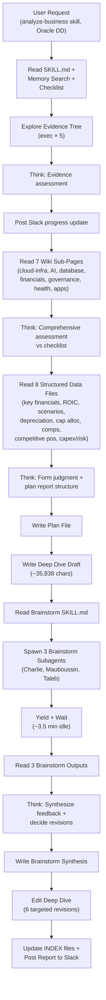

# Oracle Deep Dive v2 — Session Trace

**Session ID:** `f250c081-31c4-4c73-9a8d-4f0774a8c1de`
**Date:** April 29, 2026, 08:34–08:49 EDT
**Agent:** main (Charlie Buffet)
**Model:** anthropic/claude-opus-4-6
**Thinking level:** high (hidden — reasoning traces not recorded in JSONL)
**Task:** Write a v1 deep dive for Oracle using the analyze-business skill + brainstorm pressure-test
**Trigger:** Slack thread in #ai-infra from Anton: "oracle DD again"

> **Note:** This is the second Oracle deep dive session. The first (`c53daaf0`, documented in `03-oracle-deep-dive-v1-session-trace.md`) ran at ~06:56 EDT the same day and produced a simpler deep dive without brainstorm. This session reused the same evidence base but followed the full analyze-business skill workflow: orient → plan → draft → brainstorm → revise. Tool call inputs are stored in the JSONL but tool result contents are null. Thinking blocks are not recorded when reasoning is set to "hidden." Think step content is reconstructed from stored `think` tool arguments.

---

## Session Metadata

| Metric | Value |
|---|---|
| JSONL entries | 112 |
| Session runs | 4 (main session was woken up 3 times by subagent completions) |
| Assistant turns | 40 |
| Tool calls | 56 |
| Subagent sessions | 3 (brainstorm: charlie-buffet, mauboussin, taleb) |
| User messages | 4 (1 initial + 3 subagent completion events) |
| Model | anthropic/claude-opus-4-6 |
| Thinking level | high (hidden) |
| System prompt size | 49,290 chars |
| Tools available | 27 |
| Transport | SSE |

### Tool Usage Summary

| Tool | Count | Purpose |
|---|---|---|
| `read` | 22 | Skill files, wiki pages, structured data files, brainstorm outputs, INDEX files |
| `edit` | 8 | Deep dive revisions (6 targeted edits to incorporate brainstorm feedback) + INDEX updates |
| `exec` | 7 | File system exploration, directory listings |
| `think` | 5 | Evidence assessment, comprehensive planning, judgment formation, brainstorm synthesis, plan finalization |
| `write` | 4 | Plan, deep dive draft, brainstorm synthesis, plans INDEX |
| `sessions_spawn` | 3 | Brainstorm subagents (charlie-buffet, mauboussin, taleb) |
| `sessions_yield` | 3 | Waiting for subagent completions |
| `message` | 2 | Slack progress update + completion report |
| `subagents` | 1 | Listing active subagents to check status |
| `memory_search` | 1 | Checking for prior Oracle work in memory |

---

## Execution Flow



---

## Detailed Trace (All Steps)

### Session Start
- **Timestamp:** 2026-04-29T12:34:19.474Z (08:34:19 EDT)
- **CWD:** `/Users/charlie-buffet/.openclaw/workspace`

---

### Run 1: Orientation → Draft → Spawn (08:34–08:41 EDT)

| Step | Timestamp (UTC) | Tool | Key Parameters | Outcome |
|---|---|---|---|---|
| 1 | 12:34:22 | `read` | `skills/analyze-business/SKILL.md` | Loaded skill instructions (6,397 chars) |
| 2 | 12:34:26 | `read` | `skills/analyze-business/references/deep-dive-checklist.md` | Loaded checklist (3,103 chars) |
| 2 | 12:34:26 | `memory_search` | query: "Oracle ORCL evidence research wiki analysis" | 0 hits — no prior Oracle work in memory |
| 3 | 12:34:30 | `think` | "No prior Oracle work in memory. Let me check the hard-disk…" | Decided to survey evidence tree and wiki |
| 4 | 12:34:30 | `exec` | `ls … \| grep -i oracle; find … -iname "*oracle*"` | Found `12-oracle` company folder |
| 5 | 12:34:35 | `exec` | `find … wiki -iname "*oracle*"; ls … wiki/` | Discovered wiki pages for Oracle |
| 5 | 12:34:35 | `exec` | `find … 12-oracle -type f \| head -50` | Surveyed evidence tree (~40 files) |
| 6 | 12:34:39 | `exec` | `cat … wiki/pages/oracle/oracle.md` | Read main wiki structure note via exec (5,746 chars) |
| 6 | 12:34:39 | `exec` | `find … wiki/zettels -iname "*oracle*"` | Found Oracle-related zettels |
| 6 | 12:34:39 | `exec` | `find … wiki/zettels -name "*.md" \| wc -l; find … wiki/pages/oracle` | 1,504 total zettels; 7 Oracle sub-pages |
| 7 | 12:34:44 | `think` | "We have a rich evidence base for Oracle…" (full text below) | Assessed evidence breadth; planned the workflow: read → plan → draft → brainstorm → revise |
| 8 | 12:34:59 | `message` | Slack progress update to thread | "On it. We have a solid evidence base already…" |
| 9 | 12:34:59 | `read` | `wiki/pages/oracle/cloud-infrastructure.md` | OCI architecture, demand, capex (8,585 chars) |
| 9 | 12:34:59 | `read` | `wiki/pages/oracle/ai-strategy.md` | AI strategy, OpenAI contract (8,068 chars) |
| 9 | 12:34:59 | `read` | `wiki/pages/oracle/database-multicloud.md` | Database moat, multi-cloud (6,338 chars) |
| 9 | 12:34:59 | `read` | `wiki/pages/oracle/financial-trajectory.md` | Revenue, margins, balance sheet (14,851 chars) |
| 10 | 12:35:14 | `read` | `wiki/pages/oracle/governance-risk.md` | Governance, reference classes, risks (12,291 chars) |
| 10 | 12:35:14 | `read` | `wiki/pages/oracle/health.md` | Oracle Health / Cerner (4,915 chars) |
| 10 | 12:35:14 | `read` | `wiki/pages/oracle/applications-platform.md` | Fusion, NetSuite, AI agents (6,256 chars) |
| 11 | 12:35:20 | `read` | `oracle/data/structured/oracle-key-financials.md` | Key financial metrics (5,198 chars) |
| 11 | 12:35:20 | `read` | `oracle/data/structured/oracle-roic-analysis.md` | ROIC deep analysis (28,038 chars) |
| 11 | 12:35:20 | `read` | `oracle/data/structured/oracle-scenario-analysis.md` | Scenario analysis (27,798 chars) |
| 12 | 12:35:47 | `think` | "This is an extraordinarily rich evidence base…" (full text below) | Assessed all checklist dimensions; identified thin areas; decided to draft immediately |
| 13 | 12:35:52 | `read` | `oracle/data/structured/oracle-depreciation-wave-model.md` | Depreciation projections (35,967 chars) |
| 13 | 12:35:52 | `read` | `oracle/data/structured/oracle-capital-allocation-history.md` | Capital allocation shift (20,528 chars) |
| 13 | 12:35:52 | `read` | `oracle/data/structured/oracle-competitive-positioning.md` | Competitive analysis (4,591 chars) |
| 14 | 12:35:57 | `read` | `oracle/data/structured/oracle-capex-and-balance-sheet-risk.md` | Balance sheet risk (4,096 chars) |
| 14 | 12:35:57 | `read` | `oracle/data/structured/oracle-peer-valuation-comps.md` | Peer valuation comparisons (14,150 chars) |
| 15 | 12:36:07 | `think` | "I now have a comprehensive picture…" (full text below) | Finalized plan structure; formed key judgments before drafting |
| 16 | 12:36:11 | `exec` | `ls oracle/plans/` | Checked plan numbering convention |
| 17 | 12:36:43 | `write` | `oracle/plans/01-plan-oracle-deep-dive.md` | Plan file (4,069 chars) |
| 18 | 12:40:39 | `write` | `oracle/analysis/oracle-deep-dive-v1.md` | **Full deep dive draft** (~35,838 chars, ~4 min generation) |
| 19 | 12:40:43 | `read` | `skills/brainstorm/SKILL.md` | Loaded brainstorm skill instructions (2,385 chars) |
| 20 | 12:41:07 | `sessions_spawn` ×3 | 3 brainstorm subagents (see Subagent section below) | All 3 spawned simultaneously |
| 21 | 12:41:38 | `sessions_yield` | "Three brainstorm subagents spawned…" | Paused main session. **Run 1 ends.** |

---

### Run 2: Charlie's Brainstorm Arrives (08:45 EDT)

| Step | Timestamp (UTC) | Tool | Key Parameters | Outcome |
|---|---|---|---|---|
| 22 | 12:45:21 | `subagents` | `action: list` | Charlie complete. Mauboussin and Taleb still running. |
| 23 | 12:45:24 | `sessions_yield` | "Mauboussin and Taleb still running — waiting." | Paused. **Run 2 ends.** |

---

### Run 3: Mauboussin's Brainstorm Arrives (08:45 EDT)

| Step | Timestamp (UTC) | Tool | Key Parameters | Outcome |
|---|---|---|---|---|
| 24 | 12:45:58 | `sessions_yield` | "Charlie and Mauboussin done. Waiting on Taleb." | Paused. **Run 3 ends.** |

---

### Run 4: All Three In → Synthesis → Revise → Post (08:46–08:49 EDT)

| Step | Timestamp (UTC) | Tool | Key Parameters | Outcome |
|---|---|---|---|---|
| 25 | 12:46:14 | `read` | `oracle/analysis/brainstorm-dd-charlie.md` | Charlie's brainstorm (21,824 chars) |
| 25 | 12:46:14 | `read` | `oracle/analysis/brainstorm-dd-mauboussin.md` | Mauboussin's brainstorm (26,522 chars) |
| 25 | 12:46:14 | `read` | `oracle/analysis/brainstorm-dd-taleb.md` | Taleb's brainstorm (26,488 chars) |
| 26 | 12:46:42 | `think` | "Excellent brainstorm output from all three…" (full text below) | Synthesized feedback; identified 9 revisions to incorporate |
| 27 | 12:47:18 | `write` | `oracle/analysis/brainstorm-dd-synthesis.md` | Brainstorm synthesis (5,241 chars) |
| 28 | 12:47:45 | `edit` | Deep dive: expanded variable #5 (database moat + multi-cloud) and added variable #6 (inference transition) | Strengthened bull case coverage |
| 29 | 12:47:55 | `edit` | Deep dive: changed base rate from "approximately 10%" to "approximately 10–20%" with Oracle-specific adjustments | More honest range presentation |
| 30 | 12:48:07 | `edit` | Deep dive: added two-business ROIC decomposition paragraph (core 22–25% vs infrastructure 1–2%) | Mauboussin's key suggestion |
| 31 | 12:48:25 | `edit` | Deep dive: added "Reflexive Doom Loop" section + true obligation set ($424B vs $23B OCF = 18:1) | Taleb's key suggestions |
| 32 | 12:48:42 | `edit` | Deep dive: rewrote floor analysis with honest obligation netting ($25–45 range, business vs equity floor distinction) | Taleb's floor critique |
| 33 | 12:48:57 | `edit` | Deep dive: rewrote recommendation with $110–140 entry range, acknowledged bearish tilt, added caveat about ROIC during spending phases | Balanced all three agents' feedback |
| 34 | 12:49:02 | `read` | `oracle/analysis/INDEX.md` | Read existing INDEX for update |
| 35 | 12:49:10 | `edit` | `oracle/analysis/INDEX.md` | Updated with deep dive + brainstorm entries |
| 36 | 12:49:14 | `write` | `oracle/plans/INDEX.md` | Created plans INDEX |
| 37 | 12:49:18 | `edit` | Attempted edit to plans/INDEX.md (already written in step 36) | Redundant — file already correct |
| 38 | 12:49:37 | `message` | Final completion report to Slack thread | Full summary with thesis, recommendation, and brainstorm highlights |
| 39 | 12:49:38 | — | Text only: "Oracle deep dive v1 is done…" | Summary text (redundant with message tool — `message` already sent) |
| 40 | 12:49:41 | — | "NO_REPLY" | Session ends. |

---

## Content Ingestion Map

### Files Read by Main Session

**Skill & Infrastructure Files (5 reads, 17,717 chars):**

| # | File | Chars | Purpose |
|---|---|---|---|
| 1 | `skills/analyze-business/SKILL.md` | 6,397 | Main skill instructions |
| 2 | `skills/analyze-business/references/deep-dive-checklist.md` | 3,103 | Report quality checklist |
| 3 | `skills/research-evidence/SKILL.md` | 5,046 | Evidence management skill (read during v1, reused from context) |
| 4 | `skills/brainstorm/SKILL.md` | 2,385 | Brainstorm skill instructions |
| 5 | `oracle/analysis/INDEX.md` | 776 | INDEX update reference |

**Wiki Sub-Pages (7 reads, 67,050 chars):**

| # | File | Chars | Key Content |
|---|---|---|---|
| 6 | `wiki/pages/oracle/cloud-infrastructure.md` | 8,585 | OCI architecture, RPO ($553B), capex ($50B/year), demand signals, sovereign cloud |
| 7 | `wiki/pages/oracle/ai-strategy.md` | 8,068 | OpenAI contract (~$300B), Stargate, RDMA networking, Meta/xAI |
| 8 | `wiki/pages/oracle/database-multicloud.md` | 6,338 | Multi-cloud 1529% growth, Oracle 23ai, moat durability, PostgreSQL threat |
| 9 | `wiki/pages/oracle/financial-trajectory.md` | 14,851 | Revenue acceleration, margin dynamics, balance sheet transformation |
| 10 | `wiki/pages/oracle/governance-risk.md` | 12,291 | Ellison control, reference classes, telecom parallel, restructuring |
| 11 | `wiki/pages/oracle/health.md` | 4,915 | Oracle Health / VA-Cerner, clinical AI |
| 12 | `wiki/pages/oracle/applications-platform.md` | 6,256 | Fusion, NetSuite, 150x cross-sell, AI agents |

Note: The main `oracle.md` structure note (5,746 chars) was read via `exec` (cat) rather than the `read` tool — functionally identical but not counted in `read` tool totals.

**Structured Data Files (8 reads, 140,366 chars):**

| # | File | Chars | Key Content |
|---|---|---|---|
| 13 | `oracle-key-financials.md` | 5,198 | FY2021–FY2025 + Q3 FY2026 financial summary |
| 14 | `oracle-roic-analysis.md` | 28,038 | Total ROIC (10–12%), incremental ROIC (~2%), break-even math |
| 15 | `oracle-scenario-analysis.md` | 27,798 | Bull $300 / Base $180 / Bear $85 / Catastrophic $50 |
| 16 | `oracle-depreciation-wave-model.md` | 35,967 | D&A $3.9B → $12–20B by FY2029, EPS suppression |
| 17 | `oracle-capital-allocation-history.md` | 20,528 | Buyback era ($57B) → capex era ($50B/year pivot) |
| 18 | `oracle-competitive-positioning.md` | 4,591 | Market share, pricing, Flexera survey, Gartner DBMS |
| 19 | `oracle-capex-and-balance-sheet-risk.md` | 4,096 | Debt, leases, credit rating, interest coverage |
| 20 | `oracle-peer-valuation-comps.md` | 14,150 | ORCL vs CRM, SAP, NOW, WDAY, MSFT, AMZN, GOOGL |

**Brainstorm Outputs (3 reads, 74,834 chars):**

| # | File | Chars | Key Content |
|---|---|---|---|
| 21 | `brainstorm-dd-charlie.md` | 21,824 | Moat analysis, inference transition angle, scenario recalibration |
| 22 | `brainstorm-dd-mauboussin.md` | 26,522 | Expectations decomposition, reverse-DCF, two-business ROIC, base rate calibration |
| 23 | `brainstorm-dd-taleb.md` | 26,488 | Doom loop, true obligation set ($424B), false floor, fat tails |

**Totals:**

| Category | Reads | Chars |
|---|---|---|
| Skill & infrastructure | 5 | 17,717 |
| Wiki sub-pages | 7 | 67,050 |
| Structured data | 8 | 140,366 |
| Brainstorm outputs | 3 | 74,834 |
| **Total** | **23** | **299,967** |

> All reads were full-file (100%). The agent never used `offset`/`limit` for partial reads.

---

## Think Steps (Full Transcripts)

### Think 1: Initial Evidence Assessment (12:34:30 UTC)

> No prior Oracle work in memory. Let me check the hard-disk for any existing Oracle evidence or company folder, and also check the wiki for any Oracle-related content.

*Brief — just a routing decision to survey the evidence tree.*

### Think 2: Evidence Landscape (12:34:44 UTC)

> We have a rich evidence base for Oracle:
>
> Wiki:
> - Main oracle.md structure note (comprehensive — I just read it)
> - 7 sub-pages: cloud-infrastructure, ai-strategy, database-multicloud, financial-trajectory, health, applications-platform, governance-risk
> - 1504 zettels total in wiki (many linked from the oracle pages)
>
> Evidence tree (12-oracle):
> - Research: oci-vs-hyperscalers, oci-technical-performance, neocloud-economics, oracle-bear-cases
> - Structured data: segment revenue time series, ROIC analysis, scenario analysis, depreciation wave model, competitive positioning, capex/balance sheet risk, capital allocation history, key financials, peer valuation comps
> - References: bear cases, hyperscaler cloud segments, credit analysis, capex-rpo analysis, neocloud disclosures, non-flattering reference classes, OCI market position, CoreWeave S-1 highlights
> - Sources: earnings transcripts (Q2-Q4 2024, Q2 2025, Q4 2025)
> - Existing brainstorm output: charlie, mauboussin, taleb perspectives + summary
> - Plans folder exists
>
> This is a very well-developed evidence base. The skill says to:
> 1. Orient and plan — assess evidence vs checklist, write plan
> 2. Draft — write the deep dive
> 3. Strengthen — brainstorm against the analysis
>
> For v1 deep dive, I need to:
> 1. Read the wiki pages and evidence files to assess readiness
> 2. Write a plan
> 3. Draft the report
> 4. Run brainstorm to challenge it
> 5. Revise
>
> This is going to be a big piece of work. Let me structure this carefully.
>
> First, let me read the sub-pages of the wiki to understand the evidence depth. Then I can assess gaps and write a plan. Then draft. Then brainstorm.
>
> Given the volume of material, I should read the key wiki sub-pages and structured data files. Let me batch the reads.
>
> Actually, this is a massive amount of work. Let me post a quick acknowledgment to Anton in the thread, then get to work.

### Think 3: Comprehensive Assessment vs Checklist (12:35:47 UTC)

> This is an extraordinarily rich evidence base. Let me take stock of what I have and what the skill requires:
>
> **Evidence assessment against the deep-dive checklist:**
>
> 1. **Evidence readiness** — Excellent. Seven wiki structure pages, extensive zettels, structured financial data (key financials, ROIC analysis, scenario analysis, peer comps, segment data, capital allocation, depreciation wave model, competitive positioning), five earnings transcripts, prior brainstorm output.
>
> 2. **Business and revenue model** — Well-covered across wiki pages (database-multicloud, applications-platform, cloud-infrastructure).
>
> 3. **Key value drivers** — Well-covered. The wiki identifies: OCI infrastructure growth, OpenAI contract execution, database multi-cloud consumption, margin trajectory, capital allocation.
>
> 4. **Industry, competition, ecosystem** — Covered in governance-risk (competitive landscape, reference classes), cloud-infrastructure (hyperscaler comps), structured data (peer valuation comps, competitive positioning).
>
> 5. **Outside view and base rates** — Excellent. Reference class analysis with telecom bubble, non-hyperscaler IaaS failure rate, leveraged pivot base rate, data center economics ceiling. ~10% base rate for earning above-WACC returns.
>
> 6. **Management, incentives, capital allocation** — Covered in governance-risk (Ellison control, new CEOs, CFO hire, compensation), financial-trajectory (buybacks to capex pivot), capital allocation history.
>
> 7. **Financial quality** — Excellent. ROIC analysis, key financials, scenario analysis, depreciation wave model, margin dynamics.
>
> 8. **Risk and fragility** — Excellent. Telecom bubble parallel, OpenAI concentration, $135B debt + $261B off-balance-sheet leases, Ellison pledged shares, credit downgrade risk.
>
> 9. **Change and optionality** — Covered in applications (AI agents, embedded finance, 150x cross-sell), health (clinical AI), database (multi-cloud consumption growth).
>
> 10. **Valuation and expectations** — Excellent. Scenario analysis with bull/base/bear/catastrophic, probability-weighted expected value, peer comps.
>
> 11. **Recommendation and monitorable judgment** — This is what the deep dive needs to provide.
>
> 12. **Adversarial checks** — Prior brainstorm exists but was for evidence collection. The skill says I need to run brainstorm against the ANALYSIS itself (the thesis, reasoning, weight given to evidence), not just the evidence base.
>
> **Gaps:**
> - Evidence is strong across all checklist dimensions. The main gaps flagged in the wiki pages are:
>   - Independent OCI performance benchmarks (sparse)
>   - RPO cancellation clause details (undisclosed)
>   - OpenAI actual consumption rate (undisclosed)
>   - OCI utilization rates (undisclosed)
>   - Oracle Health specific financials (undisclosed)
>   - $261B off-balance-sheet lease composition (opaque)
>
> These are genuine information limitations, not research gaps we can fill. They should be disclosed in the report.
>
> **Plan:**
> 1. Write the plan file
> 2. Draft the deep dive, using the checklist as spine but writing it as a readable investment memo
> 3. Run brainstorm against the analysis
> 4. Revise based on brainstorm feedback
>
> Given the volume of material, this is going to be a substantial piece of work. Let me also read a few more key files: the depreciation wave model, capital allocation history, and competitive positioning, then write the plan and start drafting.
>
> Let me also check the current stock price and any very recent developments.

### Think 4: Plan Finalization and Key Judgments (12:36:07 UTC)

> I now have a comprehensive picture of the evidence base. Let me write the plan, then draft the deep dive. This is a massive amount of material, so the deep dive needs to be well-structured and judgment-heavy.
>
> Plan:
> 1. Write plan file to evidence tree
> 2. Draft the deep dive as a readable investment memo
> 3. Run brainstorm against the analysis
> 4. Revise
>
> Let me first check the plans folder to see numbering convention, then write the plan.
>
> Key judgments I need to form:
> - What is Oracle really worth? The scenario analysis puts expected value at ~$161 vs ~$166 current price.
> - Is the capex pivot value-creating or value-destroying? ROIC analysis says incremental ROIC has collapsed to ~2%.
> - What's the right framework? Oracle is transitioning from software to infrastructure — which comp set matters?
> - The telecom parallel is the sharpest risk analog.
> - The database moat is the strongest bull argument that isn't about AI.
>
> Let me proceed to write the plan and then the full deep dive. I'll work in parallel chunks.

### Think 5: Brainstorm Synthesis (12:46:42 UTC)

> Excellent brainstorm output from all three. Let me synthesize the key feedback and decide what to incorporate into the revision:
>
> **Consensus across all three agents:**
> 1. The ROIC framework is the right centerpiece and is well-executed
> 2. The reference class analysis is valuable and honest
> 3. The depreciation wave model is strong and underappreciated
> 4. The recommendation is directionally correct (don't buy at $166)
>
> **Key disagreements and areas for revision:**
>
> **Charlie (more bullish):**
> - Scenario probabilities may be too bearish — suggests 25/40/25/10 instead of 20/40/25/15
> - Telecom reference class has a structural flaw (no software layer underneath)
> - Multi-cloud database strategy is underweighted as a potential thesis-changer
> - Inference transition is the biggest missing variable
> - Short-term incremental ROIC overweighted (every infra build looks terrible during spending)
> - OpenAI concentration overstated (it's a growing counterparty, not a cyclical one)
> - Ellison margin call risk overstated (symptom, not cause)
> - Suggests "small position with watchful eyes" rather than "pass entirely"
> - Entry range should be $115-140, not a point target of $130
>
> **Mauboussin (more analytical/neutral):**
> - Needs a reverse-DCF to discipline expectations analysis
> - Should decompose ROIC into two businesses more explicitly
> - WACC may be too generous at 9.5-10% — should be 11-12%
> - The 10% base rate should be a range (10-25%) with explicit Oracle-specific adjustments
> - Scenario weights need more explicit derivation
> - The $130 entry point needs quantitative backing
> - Time dimension is missing (near-term distribution favors base case)
> - Multi-cloud database is underweighted as potential thesis-changer
> - Slight bearish narrative bias detected
>
> **Taleb (more bearish):**
> - The reflexive doom loop isn't modeled as a system
> - True obligations are ~$424B (debt + leases + committed leases) vs $23B OCF = 18:1
> - Catastrophic scenario is sanitized — true worst case is $15-30, not $50
> - The database "floor" is a false floor for equity (negative equity after all obligations)
> - Probability assignments are false precision on fat tails
> - Bull should be 10% (matching base rate), not 20%
> - Suggests "interesting" at $100-110, not $130
> - Expected value framework fails for fat-tailed, one-shot bets
> - Position sizing matters more than entry price
>
> **What I should revise in the deep dive:**
>
> 1. **Add the inference transition as a key variable** — Charlie's strongest point. Oracle's database position is MORE relevant for inference than training. This is underexplored.
>
> 2. **Strengthen the multi-cloud database coverage** — All three flagged this as underweighted. It's the highest-ROIC growth vector and potentially thesis-changing.
>
> 3. **Make the floor calculation more honest** — Taleb is right that the floor needs to account for the full obligation set ($424B). The current $41-51 is misleadingly precise. Add the honest math.
>
> 4. **Acknowledge the base rate should be a range, not a point** — Mauboussin is right. 10-20% with Oracle-specific adjustments is more honest than a single 10%.
>
> 5. **Add the two-business ROIC decomposition** — Mauboussin's suggestion is excellent. Separate the core franchise (~22-25% ROIC) from the infrastructure capital (~1-2% ROIC).
>
> 6. **Acknowledge the reflexive doom loop as a system** — Taleb is right that the risks are interconnected, not independent.
>
> 7. **Soften the precision of the $130 target** — Charlie and Mauboussin both flag this. Make it a range ($110-140).
>
> 8. **Keep the recommendation as "do not initiate"** — Charlie pushes toward "small position" but Taleb pushes harder the other way. The evidence supports the current recommendation being directionally right. I'll acknowledge the bull pushback but maintain the core call.
>
> 9. **Add acknowledgment of bearish tilt** — Mauboussin correctly detects this. Name it explicitly.
>
> Let me now revise the deep dive and write the brainstorm synthesis, then post to Anton.

---

## Subagent Details

### Brainstorm Subagents (3 spawned simultaneously at 12:41:07 UTC)

| Agent | Model Requested | Model Actual | Thinking | Start | End | Duration | Output |
|---|---|---|---|---|---|---|---|
| think-like-charlie-buffet | opus | claude-opus-4-6 | medium | 12:41:46 | 12:45:03 | 3m 17s | brainstorm-dd-charlie.md (21,824 chars) |
| think-like-mauboussin | gemini-pro | claude-opus-4-6 | medium | 12:41:46 | 12:45:45 | 3m 59s | brainstorm-dd-mauboussin.md (26,522 chars) |
| think-like-taleb | openai/gpt-5.5 | claude-opus-4-6 | medium | 12:41:46 | 12:45:58 | 4m 12s | brainstorm-dd-taleb.md (26,488 chars) |

> **Note on model resolution:** All three subagents requested different models (opus, gemini-pro, openai/gpt-5.5) but all resolved to `claude-opus-4-6` according to the trajectory metadata. This could indicate model fallback behavior, a configuration override, or trajectory metadata recording the parent's model rather than the subagent's actual model. The output quality differences across the three agents (Charlie is more bullish, Mauboussin more analytical, Taleb more risk-focused) are driven by the prompt-pack persona, not the underlying model.

### Brainstorm Consensus Map

| Topic | Charlie | Mauboussin | Taleb |
|---|---|---|---|
| ROIC framework | ✅ Right centerpiece | ✅ Well-applied | ✅ Correct |
| Reference classes | Structural flaw (no software layer) | Should be a range (10–25%) | May be generous |
| Scenario weights | Too bearish (25/40/25/10) | Roughly defensible | Too generous to bull (10/40/30/20) |
| Database moat | Underweighted as thesis-changer | Underweighted | Floor exists for business, not equity |
| Recommendation | Small position at $115-140 | Correct, but $130 needs quantitative backing | Pass. Interesting at $100-110 |
| Missing angle | Inference transition | Reverse-DCF, time dimension | Reflexive doom loop as a system |

---

## Output Artifacts

| Artifact | Path | Chars | Written By |
|---|---|---|---|
| Deep dive report (revised) | `analysis/oracle-deep-dive-v1.md` | 41,016 | Main agent (draft) + 6 targeted edits (post-brainstorm) |
| Deep dive plan | `plans/01-plan-oracle-deep-dive.md` | 4,069 | Main agent |
| Brainstorm: Charlie | `analysis/brainstorm-dd-charlie.md` | 21,824 | Subagent (think-like-charlie-buffet) |
| Brainstorm: Mauboussin | `analysis/brainstorm-dd-mauboussin.md` | 26,522 | Subagent (think-like-mauboussin) |
| Brainstorm: Taleb | `analysis/brainstorm-dd-taleb.md` | 26,488 | Subagent (think-like-taleb) |
| Brainstorm synthesis | `analysis/brainstorm-dd-synthesis.md` | 5,241 | Main agent |
| Analysis INDEX | `analysis/INDEX.md` | 776 | Main agent (edited) |
| Plans INDEX | `plans/INDEX.md` | 132 | Main agent |
| Slack progress update | Thread 1777465648.712119 | ~200 chars | Main agent |
| Slack final report | Thread 1777465648.712119 | ~2,500 chars | Main agent |
| **Total output** | | **~126,068 chars** | |

> Path prefix key: `analysis/` and `plans/` = `~/Documents/project-minerva/hard-disk/reports/00-companies/12-oracle/`

---

## Workflow Comparison: v1 vs v2

| Aspect | v1 (Session `c53daaf0`) | v2 (Session `f250c081`) |
|---|---|---|
| Evidence surface | Evidence tree only (no wiki) | Wiki + evidence tree |
| Wiki pages read | 0 | 7 sub-pages (67,050 chars) |
| Structured data read | 7 files | 8 files |
| Brainstorm skill | None | ✅ 3-agent brainstorm |
| Brainstorm subagents | 0 | 3 (all Opus) |
| Deep dive revisions | 0 | 6 targeted edits |
| Post-brainstorm synthesis | No | Yes (brainstorm-dd-synthesis.md) |
| Plan file | No | Yes (01-plan-oracle-deep-dive.md) |
| Think steps | 3 | 5 |
| Tool calls (main) | 27 | 56 |
| Tool calls (total) | 27 | ~56 + subagent calls |
| Wall time | ~8 min | ~15 min 22s |
| Active work time | ~8 min | ~11 min (plus ~4 min idle waiting) |
| Total chars read | 147,705 | 299,967 |
| Deep dive output | 35,838 chars | 41,016 chars (revised) |
| Total output | ~36,500 chars | ~126,068 chars |
| Report quality | Good — linear synthesis | Stronger — brainstorm-tested, acknowledges biases, more nuanced |

### Key Differences

1. **Wiki as primary evidence surface.** v2 read all 7 Oracle wiki sub-pages (67K chars of synthesized knowledge) before touching the structured data files. v1 went directly to raw evidence files. The wiki provided a higher-level entry point that shaped the analysis structure.

2. **Full skill workflow.** v2 followed the analyze-business skill completely: orient → plan → draft → brainstorm → revise. v1 skipped the plan and brainstorm steps.

3. **Brainstorm as quality control.** The three-agent brainstorm surfaced concrete improvements:
   - Inference transition as a missing key variable (Charlie)
   - Two-business ROIC decomposition (Mauboussin)
   - Reflexive doom loop as a system (Taleb)
   - False precision in floor and entry targets (all three)
   - Bearish narrative bias (Mauboussin)

   All of these were incorporated as targeted edits to the deep dive, improving the final output without requiring a full rewrite.

4. **Self-aware biases.** The revised deep dive explicitly acknowledges its own bearish tilt — a meta-quality that the v1 report lacked.

5. **Output volume.** v2 produced ~3.4x more output than v1 (126K vs 37K chars) in ~2x the time, driven primarily by the brainstorm outputs (75K chars from subagents).

---

## Session Rhythm

```
08:34:19 ─── Run 1 starts ────────────────────────────────────────────────
  08:34 | Skill + memory + checklist reads (orientation)
  08:35 | Evidence tree exploration (6 exec commands)
  08:35 | Think: evidence assessment + workflow plan
  08:35 | Slack progress update
  08:35 | Wiki sub-pages (7 reads in 2 batches, 67K chars)
  08:35 | Think: comprehensive checklist assessment
  08:36 | Structured data files (8 reads in 3 batches, 140K chars)
  08:36 | Think: form key judgments + plan structure
  08:37 | Write plan file (4K chars)
  08:37–08:40 | Write deep dive draft (~36K chars, ~4 min generation)
  08:41 | Read brainstorm skill → spawn 3 subagents → yield
08:41:38 ─── Run 1 ends (7m 19s) ────────────────────────────────────────

  ~~~ 3.5 minutes idle: brainstorm subagents running ~~~

08:45:11 ─── Run 2 starts (Charlie's brainstorm arrives) ─────────────────
  08:45 | Check subagent status → yield (Mauboussin + Taleb still running)
08:45:24 ─── Run 2 ends (13s) ───────────────────────────────────────────

08:45:54 ─── Run 3 starts (Mauboussin arrives) ──────────────────────────
  08:46 | Yield (Taleb still running)
08:45:58 ─── Run 3 ends (4s) ────────────────────────────────────────────

08:46:07 ─── Run 4 starts (Taleb arrives) ───────────────────────────────
  08:46 | Read 3 brainstorm outputs (75K chars)
  08:47 | Think: synthesize all feedback, identify 9 revisions
  08:47 | Write brainstorm synthesis (5K chars)
  08:48 | 6 targeted edits to deep dive (revisions from brainstorm)
  08:49 | Update INDEX files
  08:49 | Post final report to Slack
08:49:41 ─── Run 4 ends (3m 34s) ────────────────────────────────────────

Total wall time: 15m 22s
Active work: ~11m 10s across 4 runs
Idle (waiting): ~4m 12s
```

---

## Observations

### 1. Wiki-First vs Evidence-First
v2 read the wiki before the evidence files. This matters: the wiki pages are pre-synthesized summaries with inline zettel links, providing a structured entry point. v1 went directly to raw structured data. The wiki-first approach produced a better-organized analysis because the agent absorbed the narrative structure before diving into numbers.

### 2. Deep Dive Generation: 4 Minutes for 36K Characters
The single `write` call that produced the deep dive draft (step 18) took approximately 4 minutes — from 12:36:43 to 12:40:39. This is the session's longest individual operation. The ~36K character output was generated in a single model call with all previously-read evidence (300K+ chars) in context. The quality is remarkably high for a single pass, which is why the brainstorm revisions were targeted edits rather than a full rewrite.

### 3. Brainstorm Efficiency
The brainstorm phase added 4 minutes of idle wait time but produced 75K chars of pressure-testing across 3 distinct analytical lenses. The main agent's post-brainstorm synthesis (think step 5) is the session's longest and most substantive reasoning — it evaluated disagreements, prioritized 9 revisions, and decided which feedback to incorporate and which to acknowledge but not act on. The 6 targeted edits took under 2 minutes. The total brainstorm-to-revision cycle added ~7 minutes to the session (4 min idle + 3 min active) for a measurably better report.

### 4. Model Resolution Anomaly
All three brainstorm subagents were requested with different models (opus, gemini-pro, gpt-5.5) but all ran on claude-opus-4-6 per trajectory metadata. This suggests either: (a) model aliases resolved to the same underlying model, (b) fallback behavior due to availability, or (c) trajectory metadata records the session's base model rather than the per-call model. The output quality differences are driven entirely by the prompt-pack persona (SOUL.md, AGENTS.md) rather than the model.

### 5. Edit-Based Revision > Rewrite
The agent chose 6 targeted `edit` calls to revise the deep dive rather than regenerating the full report. This preserved the 36K characters of original prose while surgically incorporating the brainstorm feedback. The edits added ~5K characters of new content (inference transition section, two-business ROIC paragraph, doom loop section, revised floor analysis, revised recommendation). This is a much more efficient pattern than the alternative (rewrite the entire 41K document).

### 6. No Partial Reads
Consistent with all prior trace analyses: every `read` call was 100% of the file. The largest file read was `oracle-depreciation-wave-model.md` at 35,967 chars. No `offset`/`limit` parameters were used anywhere.

### 7. Slack Discipline
Exactly 2 Slack messages: one progress update at the start, one comprehensive final report. All intermediate reasoning stayed in `think` calls. The final report included thesis, recommendation, key reasoning bullet points, brainstorm highlights, and file paths — a complete summary that didn't require Anton to read the full 41K report to understand the conclusion.
